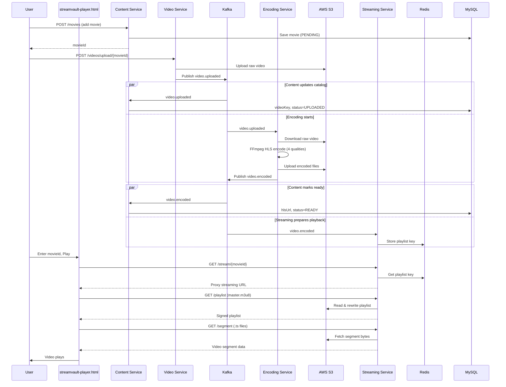

# StreamVault — Project Documentation

> A microservices-based video streaming platform. This document explains the full architecture, end-to-end flow, and code in detail — useful for resume preparation and technical interviews.
>
> **Quick start:** See [README.md](README.md)

---

## Table of Contents

1. [Project Overview](#1-project-overview)
2. [Architecture at a Glance](#2-architecture-at-a-glance)
3. [Technology Stack](#3-technology-stack)
4. [Infrastructure (Docker)](#4-infrastructure-docker)
5. [Microservices Breakdown](#5-microservices-breakdown)
6. [End-to-End Flow (Complete Journey)](#6-end-to-end-flow-complete-journey)
7. [Kafka Event-Driven Communication](#7-kafka-event-driven-communication)
8. [Video Processing Pipeline (FFmpeg + HLS)](#8-video-processing-pipeline-ffmpeg--hls)
9. [Streaming & Security Design](#9-streaming--security-design)
10. [Frontend Player](#10-frontend-player)
11. [API Reference](#11-api-reference)
12. [Database Schema](#12-database-schema)
13. [How to Run the Project](#13-how-to-run-the-project)
14. [Resume Talking Points](#14-resume-talking-points)
15. [Interview Q&A](#15-interview-qa)

---

## 1. Project Overview

This project is a **microservices-based video streaming platform** using a modern distributed architecture. It covers the full lifecycle of a movie:

```
Add Movie → Upload Raw Video → Encode to HLS → Stream to User
```

### What problem does it solve?

Real streaming platforms (Netflix, YouTube, Prime Video) don't serve raw `.mp4` files directly. They:

1. Store raw uploads in object storage (S3)
2. Transcode videos into multiple qualities (1080p, 720p, 480p, etc.)
3. Package them as **HLS** (HTTP Live Streaming) segments
4. Serve them securely via **presigned/proxy URLs**
5. Use **event-driven** processing so upload doesn't block encoding

This project implements all of that in a simplified, interview-ready form.

---

## 2. Architecture at a Glance

```
┌─────────────────────────────────────────────────────────────────────────────┐
│                              CLIENT LAYER                                    │
│                    streamvault-player.html  (HLS.js player)                      │
└──────────────────────────────────┬──────────────────────────────────────────┘
                                   │ HTTP
                                   ▼
┌─────────────────────────────────────────────────────────────────────────────┐
│                         MICROSERVICES LAYER                                  │
│                                                                              │
│  ┌──────────────┐  ┌──────────────┐  ┌──────────────┐  ┌──────────────┐    │
│  │   Content    │  │    Video     │  │   Encoding   │  │  Streaming   │    │
│  │   Service    │  │   Service    │  │   Service    │  │   Service    │    │
│  │   :8081      │  │   :8082      │  │   :8083      │  │   :8084      │    │
│  └──────┬───────┘  └──────┬───────┘  └──────┬───────┘  └──────┬───────┘    │
│         │                 │                 │                 │             │
└─────────┼─────────────────┼─────────────────┼─────────────────┼─────────────┘
          │                 │                 │                 │
          ▼                 ▼                 ▼                 ▼
┌─────────────┐    ┌─────────────┐    ┌─────────────┐    ┌─────────────┐
│    MySQL    │    │   AWS S3    │    │   FFmpeg    │    │    Redis    │
│  (Catalog)  │    │  (Storage)  │    │  (Encode)   │    │   (Cache)   │
└─────────────┘    └─────────────┘    └─────────────┘    └─────────────┘
                          ▲                 ▲
                          │                 │
                    ┌─────┴─────────────────┴─────┐
                    │         Apache Kafka         │
                    │  Topics: video.uploaded      │
                    │          video.encoded       │
                    └─────────────────────────────┘
```

### Design Patterns Used

| Pattern | Where |
|---------|-------|
| **Microservices** | 4 independent Spring Boot services |
| **Event-Driven Architecture** | Kafka pub/sub between services |
| **CQRS-lite** | Content Service owns catalog; Streaming Service owns playback |
| **Proxy Pattern** | Streaming Service proxies S3 content to avoid CORS |
| **Cache-Aside** | Redis caches streaming URLs and playlist keys |

---

## 3. Technology Stack

| Layer | Technology | Purpose |
|-------|-----------|---------|
| Backend Framework | Spring Boot 4.1 (Java 17) | REST APIs, dependency injection |
| Database | MySQL 8.0 | Movie catalog persistence |
| Message Broker | Apache Kafka 7.4 | Async event communication |
| Object Storage | AWS S3 | Raw & encoded video storage |
| Cache | Redis | Streaming URL & playlist key cache |
| Video Encoding | FFmpeg | HLS transcoding (multi-quality) |
| Frontend | HTML + HLS.js | Video playback in browser |
| Build Tool | Maven | Dependency management |
| Infrastructure | Docker Compose | MySQL, Kafka, Zookeeper, Redis |

---

## 4. Infrastructure (Docker)

File: `docker-compose.yml`

Docker runs the **shared infrastructure** only. The 4 Spring Boot services run locally (not containerized).

| Container | Port | Role |
|-----------|------|------|
| `mysql-streamvault` | 3306 | Stores movie catalog (`content_db`) |
| `kafka` | 9092 | Event streaming between services |
| `zookeeper` | 2181 | Kafka coordination |
| `redis-streamvault` | 6379 | Caching layer for streaming |

**Start infrastructure:**
```bash
docker-compose up -d
```

---

## 5. Microservices Breakdown

### 5.1 Content Service (Port 8081)

**Responsibility:** Movie catalog management — the content browse/metadata layer.

**Key files:**
- `ContentController.java` — REST endpoints
- `ContentService.java` — Business logic
- `Movie.java` — JPA entity
- `VideoUploadedEncodedEventConsumer.java` — Kafka listener

**What it does:**
- CRUD operations for movies (add, list, search, filter by genre)
- Tracks video processing status (`PENDING → UPLOADED → READY / FAILED`)
- Listens to Kafka events to update `videoKey` and `hlsUrl` in the database

**Movie lifecycle states (`VideoStatus` enum):**
```
PENDING   → Movie added, no video yet
UPLOADED  → Raw video uploaded to S3
ENCODING  → (reserved for future use)
ENCODED   → (reserved for future use)
READY     → HLS playlist available, can stream
FAILED    → Encoding failed
```

---

### 5.2 Video Service (Port 8082)

**Responsibility:** Accept raw video uploads and store them in S3.

**Key files:**
- `VideoController.java` — Upload endpoint
- `VideoService.java` — S3 upload + Kafka publish
- `VideoUploadedEvent.java` — Kafka event payload
- `KafkaConfig.java` — Creates Kafka topics

**What it does:**
1. Receives a multipart video file for a given `movieId`
2. Generates a unique S3 key: `raw/{movieId}/{uuid}_{filename}`
3. Uploads to AWS S3
4. Publishes `VideoUploadedEvent` to Kafka topic `video.uploaded`

**Why separate from Content Service?**
Uploading large files (up to 2GB) is I/O-heavy. Keeping it in its own service allows independent scaling and avoids blocking catalog APIs.

---

### 5.3 Encoding Service (Port 8083)

**Responsibility:** Transcode raw videos into HLS format at multiple qualities.

**Key files:**
- `VideoEventConsumer.java` — Listens to `video.uploaded`
- `EncodingService.java` — Full FFmpeg pipeline
- `VideoEncodedEvent.java` — Published on completion

**What it does:**
1. Consumes `video.uploaded` event from Kafka
2. Downloads raw video from S3 to local temp directory
3. Runs FFmpeg to encode 4 qualities: **1080p, 720p, 480p, 360p**
4. Generates HLS playlists (`.m3u8`) and segments (`.ts`)
5. Creates a **master playlist** referencing all qualities
6. Uploads all encoded files back to S3 under `encoded/{movieId}/`
7. Publishes `VideoEncodedEvent` to Kafka topic `video.encoded`
8. Cleans up temp files

**No REST API** — this service is purely event-driven (headless worker).

---

### 5.4 Streaming Service (Port 8084)

**Responsibility:** Serve secure streaming URLs and proxy HLS content to the browser.

**Key files:**
- `StreamingController.java` — Stream, playlist, segment endpoints
- `StreamingService.java` — URL generation, M3U8 rewriting, S3 proxy
- `VideoEncodedEventConsumer.java` — Stores playlist key in Redis
- `WebConfig.java` — CORS for browser access

**What it does:**
1. On `video.encoded` event → stores master playlist S3 key in Redis
2. On stream request → returns a proxy URL (not direct S3 URL)
3. Proxies `.m3u8` playlists and `.ts` segments from S3
4. Caches streaming URLs in Redis (55 min TTL)

**Why proxy instead of direct S3 URLs?**
- S3 buckets are private (security)
- Avoids browser CORS issues with S3
- Central place to add auth, rate limiting, analytics later

---

## 6. End-to-End Flow (Complete Journey)

### Step-by-Step: From "Add Movie" to "Play Video"

```
 STEP 1: ADD MOVIE
 ─────────────────
 Admin/Dev → POST /api/v1/movies (Content Service :8081)
           → Movie saved in MySQL with videoStatus = PENDING
           → Returns movieId (UUID)


 STEP 2: UPLOAD VIDEO
 ────────────────────
 Admin/Dev → POST /api/v1/videos/upload/{movieId} (Video Service :8082)
           → Video uploaded to S3: raw/{movieId}/{uuid}_video.mp4
           → Kafka event published: video.uploaded


 STEP 3: KAFKA FAN-OUT (video.uploaded)
 ──────────────────────────────────────
 Two consumers react in parallel:

   ┌─ Content Service Consumer
   │    → Updates movie.videoKey in MySQL
   │    → Sets videoStatus = UPLOADED
   │
   └─ Encoding Service Consumer
        → Starts FFmpeg encoding pipeline


 STEP 4: ENCODING (Encoding Service)
 ───────────────────────────────────
 Encoding Service:
   1. Download raw video from S3
   2. Encode to 1080p, 720p, 480p, 360p (HLS)
   3. Generate master.m3u8
   4. Upload all files to S3: encoded/{movieId}/
   5. Publish Kafka event: video.encoded


 STEP 5: KAFKA FAN-OUT (video.encoded)
 ──────────────────────────────────────
 Two consumers react in parallel:

   ┌─ Content Service Consumer
   │    → Updates movie.hlsUrl in MySQL
   │    → Sets videoStatus = READY
   │
   └─ Streaming Service Consumer
        → Stores master playlist S3 key in Redis
           Key: streaming:playlist:{movieId}
           Value: encoded/{movieId}/master.m3u8


 STEP 6: USER PLAYS VIDEO
 ────────────────────────
 User → Opens streamvault-player.html
      → Enters movieId, clicks Play
      → GET /api/v1/stream/{movieId} (Streaming Service :8084)
      → Returns proxy URL for master playlist
      → HLS.js fetches playlist → quality playlists → .ts segments
      → Video plays in browser
```

### Sequence Diagram



---

## 7. Kafka Event-Driven Communication

### Topics

| Topic | Publisher | Consumers | Purpose |
|-------|-----------|-----------|---------|
| `video.uploaded` | Video Service | Content Service, Encoding Service | Raw video is in S3, start processing |
| `video.encoded` | Encoding Service | Content Service, Streaming Service | HLS encoding done (or failed) |

Topics are auto-created by `KafkaConfig.java` in Video Service (3 partitions, 1 replica).

### Event Payloads

**VideoUploadedEvent** (topic: `video.uploaded`)
```json
{
  "movieId": "uuid-of-movie",
  "videoKey": "raw/movieId/uuid_filename.mp4",
  "bucketName": "streamvault-streaming-videos-...",
  "originalFileName": "movie.mp4",
  "fileSizeBytes": 104857600
}
```

**VideoEncodedEvent** (topic: `video.encoded`)
```json
{
  "movieId": "uuid-of-movie",
  "hlsUrl": "https://bucket.s3.amazonaws.com/encoded/movieId/master.m3u8",
  "masterPlaylistKey": "encoded/movieId/master.m3u8",
  "success": true,
  "errorMessage": null
}
```

### Why Kafka?

- **Decoupling:** Video Service doesn't need to know about Encoding or Content services
- **Async processing:** Upload returns immediately; encoding runs in background
- **Scalability:** Multiple encoding workers can consume from the same topic
- **Reliability:** Events are persisted; consumers can replay on failure

---

## 8. Video Processing Pipeline (FFmpeg + HLS)

### What is HLS?

**HTTP Live Streaming (HLS)** splits a video into small `.ts` segment files (~10 seconds each) and an `.m3u8` playlist that tells the player which segments to fetch and in what order.

### Encoding Qualities

| Quality | Resolution | Bitrate |
|---------|-----------|---------|
| 1080p | 1920×1080 | 5000 kbps |
| 720p | 1280×720 | 2800 kbps |
| 480p | 854×480 | 1200 kbps |
| 360p | 640×360 | 800 kbps |

### S3 Folder Structure After Encoding

```
s3://bucket/
├── raw/
│   └── {movieId}/
│       └── {uuid}_original.mp4          ← Raw upload
└── encoded/
    └── {movieId}/
        ├── master.m3u8                    ← Master playlist (entry point)
        ├── 1080p/
        │   ├── playlist.m3u8
        │   ├── segment_000.ts
        │   ├── segment_001.ts
        │   └── ...
        ├── 720p/
        │   ├── playlist.m3u8
        │   └── segment_*.ts
        ├── 480p/ ...
        └── 360p/ ...
```

### Master Playlist Example

```m3u8
#EXTM3U
#EXT-X-VERSION:3

#EXT-X-STREAM-INF:BANDWIDTH=5000000, RESOLUTION=1920x1080,CODECS="avc1.42e01e,mp4a.40.2"
1080p/playlist.m3u8

#EXT-X-STREAM-INF:BANDWIDTH=2800000, RESOLUTION=1280x720,CODECS="avc1.42e01e,mp4a.40.2"
720p/playlist.m3u8
...
```

The player reads this and picks the best quality based on network speed (adaptive bitrate streaming).

### FFmpeg Command (per quality)

```bash
ffmpeg -i raw_video.mp4 \
  -vf scale=1920:1080 \
  -c:v libx264 -b:v 5000K \
  -c:a aac -b:a 128k \
  -hls_time 10 \
  -hls_list_size 0 \
  -hls_segment_filename segment_%03d.ts \
  -f hls playlist.m3u8
```

---

## 9. Streaming & Security Design

### The Problem

S3 bucket is **private** — browsers cannot directly access video files. But HLS players need to fetch playlists and segments.

### The Solution: Proxy + URL Rewriting

```
Browser                    Streaming Service              S3 (Private)
   │                              │                          │
   │── GET /stream/{movieId} ────►│                          │
   │◄── proxy URL for master ─────│                          │
   │                              │                          │
   │── GET /playlist?path=... ───►│── read master.m3u8 ─────►│
   │                              │◄── raw m3u8 content ─────│
   │                              │   rewrite all URLs to     │
   │                              │   point back to proxy     │
   │◄── rewritten playlist ───────│                          │
   │                              │                          │
   │── GET /segment?path=... ────►│── read .ts bytes ────────►│
   │◄── video segment bytes ──────│◄─────────────────────────│
```

### Key Methods in `StreamingService.java`

| Method | Purpose |
|--------|---------|
| `getStreamingUrl()` | Returns proxy URL, caches in Redis |
| `getSignedPlaylist()` | Reads m3u8 from S3, rewrites segment URLs to proxy |
| `rewriteM3u8SignedUrls()` | Replaces relative paths with proxy URLs |
| `readBytesFromS3()` | Fetches `.ts` segment bytes for the player |

### Redis Cache Keys

| Key Pattern | Value | Set By |
|-------------|-------|--------|
| `streaming:playlist:{movieId}` | S3 key of master.m3u8 | Streaming Service (on encode complete) |
| `streaming:url:{movieId}` | Cached proxy streaming URL | Streaming Service (on first play request) |

---

## 10. Frontend Player

File: `streamvault-player.html`

A single-page HTML app (no framework) that:

1. Takes a `movieId` input
2. Calls `GET http://localhost:8084/api/v1/stream/{movieId}`
3. Uses **HLS.js** library to play the returned HLS stream
4. Shows stream metadata (qualities, expiry, URL)

**Key JavaScript flow:**
```javascript
fetch('/api/v1/stream/' + movieId)
  → response.streamingUrl (proxy URL to master playlist)
  → Hls.loadSource(streamingUrl)
  → Hls.attachMedia(videoElement)
  → video plays
```

HLS.js handles adaptive bitrate — it automatically switches between 1080p/720p/480p/360p based on network conditions.

---

## 11. API Reference

### Content Service — `http://localhost:8081`

| Method | Endpoint | Description |
|--------|----------|-------------|
| `POST` | `/api/v1/movies` | Add a new movie |
| `GET` | `/api/v1/movies` | List all movies |
| `GET` | `/api/v1/movies/{movieId}` | Get movie by ID |
| `GET` | `/api/v1/movies/genre/{genre}` | Filter by genre |
| `GET` | `/api/v1/movies/search?title=...` | Search by title |

**Add Movie Example:**
```bash
curl -X POST http://localhost:8081/api/v1/movies \
  -H "Content-Type: application/json" \
  -d '{
    "title": "Inception",
    "description": "A mind-bending thriller",
    "genre": "SCIFI",
    "director": "Christopher Nolan",
    "cast": "Leonardo DiCaprio",
    "releaseYear": 2010,
    "rating": 8.8,
    "durationMinutes": 148
  }'
```

### Video Service — `http://localhost:8082`

| Method | Endpoint | Description |
|--------|----------|-------------|
| `POST` | `/api/v1/videos/upload/{movieId}` | Upload raw video (multipart) |

**Upload Example:**
```bash
curl -X POST http://localhost:8082/api/v1/videos/upload/{movieId} \
  -F "file=@/path/to/video.mp4"
```

### Streaming Service — `http://localhost:8084`

| Method | Endpoint | Description |
|--------|----------|-------------|
| `GET` | `/api/v1/stream/{movieId}` | Get streaming URL |
| `GET` | `/api/v1/stream/{movieId}/playlist?path=...` | Get rewritten m3u8 playlist |
| `GET` | `/api/v1/stream/{movieId}/segment?path=...` | Get video segment bytes |

### Encoding Service — No REST API

Purely event-driven via Kafka.

---

## 12. Database Schema

**Table: `movies`** (MySQL — `content_db`)

| Column | Type | Description |
|--------|------|-------------|
| `id` | VARCHAR (UUID) | Primary key |
| `title` | VARCHAR | Movie title |
| `description` | VARCHAR(1000) | Synopsis |
| `genre` | ENUM | ACTION, COMEDY, DRAMA, HORROR, SCIFI, etc. |
| `director` | VARCHAR | Director name |
| `cast` | VARCHAR | Cast members |
| `release_year` | INT | Year released |
| `rating` | DOUBLE | Rating (e.g. 8.5) |
| `thumbnail_url` | VARCHAR | Poster image URL |
| `duration_minutes` | INT | Runtime |
| `video_key` | VARCHAR | S3 key for raw video |
| `hls_url` | VARCHAR | HLS master playlist URL |
| `video_status` | ENUM | PENDING, UPLOADED, READY, FAILED |
| `created_at` | TIMESTAMP | Auto-set on create |
| `updated_at` | TIMESTAMP | Auto-updated |

---

## 13. How to Run the Project

### Prerequisites

- Java 17+
- Maven
- Docker & Docker Compose
- FFmpeg (included in project — run `setup-env.ps1` to configure paths)
- AWS account with S3 bucket (or use env vars)

### Steps

```powershell
# 1. Set environment paths (run in each terminal before starting services)
. .\setup-env.ps1

# 2. Start infrastructure
docker-compose up -d

# 3. Start all 4 services (each in its own terminal)
cd content-service   && mvn spring-boot:run
cd video-service     && mvn spring-boot:run
cd encoding-service  && mvn spring-boot:run
cd streaming-service && mvn spring-boot:run

# 4. Add a movie
curl -X POST http://localhost:8081/api/v1/movies -H "Content-Type: application/json" -d '{...}'

# 5. Upload a video (use the movieId from step 4)
curl -X POST http://localhost:8082/api/v1/videos/upload/{movieId} -F "file=@video.mp4"

# 6. Wait for encoding to complete (check encoding-service logs)

# 7. Open streamvault-player.html in browser, enter movieId, click Play
```

### Service Ports Summary

| Service | Port |
|---------|------|
| Content Service | 8081 |
| Video Service | 8082 |
| Encoding Service | 8083 |
| Streaming Service | 8084 |
| MySQL | 3306 |
| Kafka | 9092 |
| Redis | 6379 |

---

## 14. Resume Talking Points

Use these bullet points on your resume and in interviews:

### One-liner
> Built StreamVault, a microservices-based video streaming platform using Spring Boot, Apache Kafka, AWS S3, Redis, and FFmpeg HLS encoding.

### Detailed bullets

- **Designed and implemented 4 microservices** (Content, Video, Encoding, Streaming) following event-driven architecture with Apache Kafka for async communication
- **Built an automated video transcoding pipeline** using FFmpeg to encode videos into 4 adaptive bitrate qualities (1080p–360p) with HLS packaging
- **Implemented secure video delivery** using S3 presigned URLs and a proxy layer to prevent unauthorized access and resolve CORS issues
- **Integrated Redis caching** for streaming URLs and playlist metadata, reducing S3 API calls and improving playback latency
- **Developed RESTful APIs** for movie catalog management (CRUD, search, genre filtering) with MySQL persistence via Spring Data JPA
- **Created an HLS.js-based video player** supporting adaptive bitrate streaming with a custom StreamVault UI

### Skills to highlight

`Java` · `Spring Boot` · `Microservices` · `Apache Kafka` · `AWS S3` · `Redis` · `MySQL` · `FFmpeg` · `HLS` · `REST APIs` · `Docker` · `Event-Driven Architecture`

---

## 15. Interview Q&A

### Q: Why microservices instead of a monolith?

**A:** Each service has a distinct responsibility and scaling need. Video upload is I/O-heavy (2GB files), encoding is CPU-heavy (FFmpeg), and streaming is latency-sensitive. Separating them allows independent scaling — e.g., run 3 encoding workers but only 1 content service.

### Q: Why Kafka and not direct HTTP calls?

**A:** When a video is uploaded, two things must happen (update catalog + start encoding). With HTTP, Video Service would need to know about both services and handle failures. Kafka decouples them — Video Service publishes one event, and any number of consumers react independently. If Encoding Service is down, the event waits in Kafka.

### Q: What is HLS and why use it?

**A:** HLS (HTTP Live Streaming) breaks video into small HTTP-downloadable segments. Benefits: adaptive bitrate (player switches quality based on bandwidth), works through firewalls/CDNs, and is supported by all major browsers via HLS.js.

### Q: How do you secure the videos?

**A:** S3 bucket is private. The Streaming Service acts as a proxy — it reads content from S3 server-side and serves it to the browser. Playlists are rewritten so all segment URLs point back to the proxy, never exposing direct S3 URLs.

### Q: What happens if encoding fails?

**A:** Encoding Service publishes a `VideoEncodedEvent` with `success=false` and an error message. Content Service sets `videoStatus=FAILED`. Streaming Service logs the error and does not cache a playlist key, so stream requests return 404.

### Q: How would you scale this in production?

**A:**
- Run multiple Encoding Service instances (Kafka consumer group auto-balances)
- Use AWS MediaConvert instead of local FFmpeg
- Add an API Gateway (Spring Cloud Gateway) in front of services
- Use CloudFront CDN for segment delivery
- Add authentication (JWT/OAuth2) to Streaming Service
- Use Kubernetes for orchestration

### Q: What is the role of Redis?

**A:** Two purposes: (1) Store the master playlist S3 key per movie so Streaming Service can quickly look it up, and (2) Cache the generated proxy streaming URL to avoid regenerating it on every request (55-minute TTL).

---

## Project File Map

```
STREAMVAULT/
├── docker-compose.yml              # Infrastructure (MySQL, Kafka, Redis)
├── streamvault-player.html             # Frontend HLS player
├── content-service/                # Port 8081 — Movie catalog
│   └── src/main/java/.../
│       ├── controller/ContentController.java
│       ├── service/ContentService.java
│       ├── service/VideoUploadedEncodedEventConsumer.java
│       ├── model/Movie.java
│       └── repository/MovieRepository.java
├── video-service/                  # Port 8082 — Video upload
│   └── src/main/java/.../
│       ├── controller/VideoController.java
│       ├── service/VideoService.java
│       ├── event/VideoUploadedEvent.java
│       └── config/KafkaConfig.java
├── encoding-service/               # Port 8083 — FFmpeg encoding
│   └── src/main/java/.../
│       ├── service/EncodingService.java
│       ├── service/VideoEventConsumer.java
│       └── event/VideoEncodedEvent.java
└── streaming-service/              # Port 8084 — Video playback
    └── src/main/java/.../
        ├── controller/StreamingController.java
        ├── service/StreamingService.java
        ├── service/VideoEncodedEventConsumer.java
        └── config/AppConfig.java
```

---

*This document was generated from the actual codebase. Use it to prepare for interviews and explain your project confidently.*
